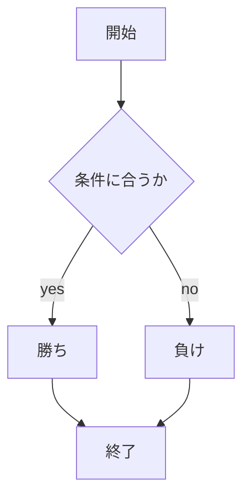
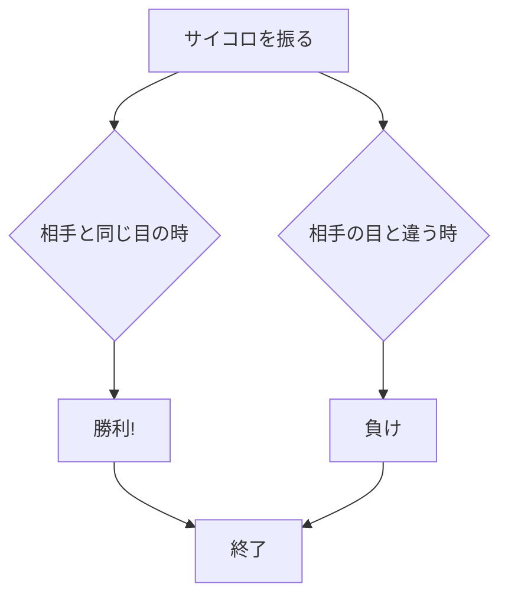
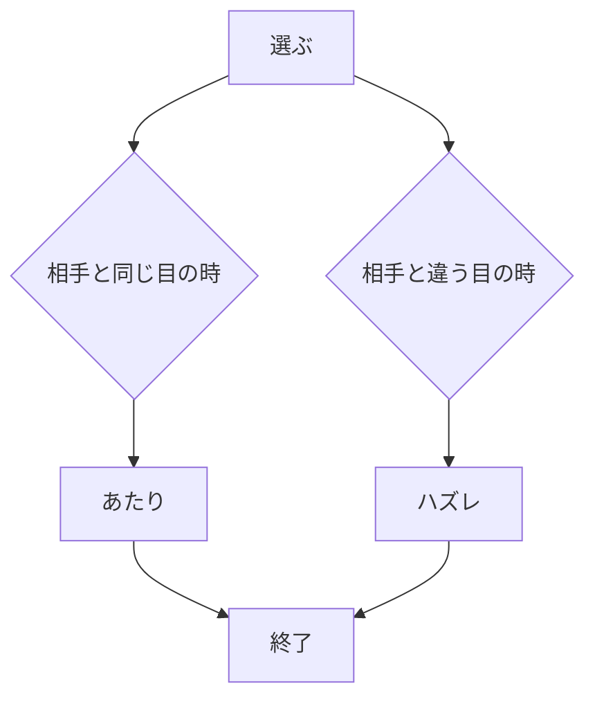

# webpro_06
2024/11/18

## このプログラムについて

- **相手と同じ目を出せ!**:自分と相手でサイコロを振り自分が相手と同じ目を出したら勝ち
- **どっちの手に入ってるかゲーム**:自分が相手のどっちの手が当たりかを当てたら勝ち
## ファイル一覧

ファイル名 | 説明 
-|-
onajime.ejs | 同じ目あてクイズの結果画面
dochinote.ejs | どっちの手に入ってるかクイズの結果画面
onajime.html | 同じ目当てクイズの開始画面
dochinote.html | どっちの手に入ってるかクイズの開始画面


### じゃんけん


### 相手と同じ目を出せ！の解説

1. ページにアクセスする
1. サイコロを振る
1. 相手の結果と勝敗が表示される





### どっちの手に入ってるかクイズ

どっちの手に入ってるかクイズとは片方の手に当たりが入っていて,そのあたりを当てるゲームである.




### 起動方法

1. ターミナルを開きwebpro_06に移動する
```
cd webpro_06
```
1. サーバーを起動する
```
node app5.js
```
1. ブラウザで次のURLにアクセスする
```
http://localhost:8080/public/onajime.html
http://localhost:8080/public/dochinote.html
```
