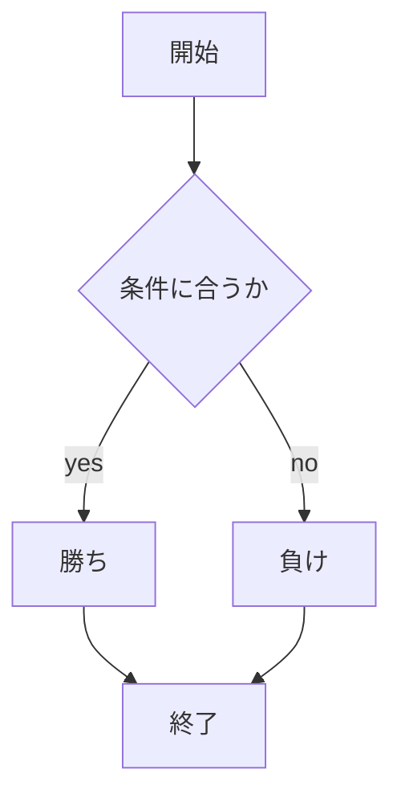
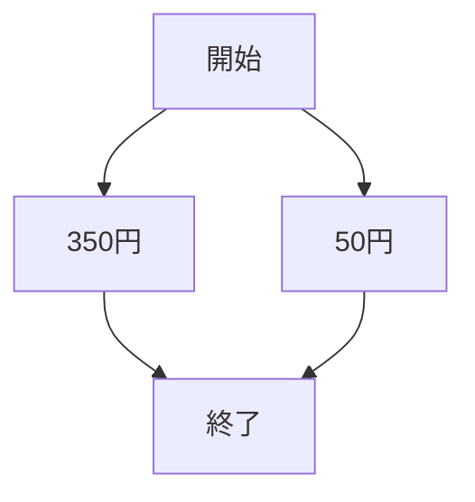
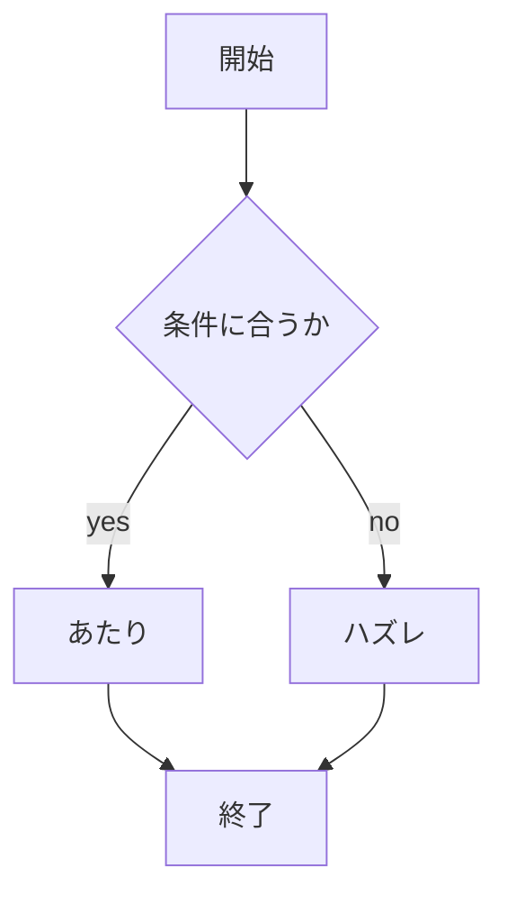

# webpro_06
2024/11/18

## このプログラムについて

## ファイル一覧

ファイル名 | 作ったシステム 
gakusyoku | 学食の値段あてクイズ
dochinote | どっちの手に入ってるかクイズ

1. app5.js を起動する
1. Webブラウザでlocalhost:8080/public/(ファイル名).htmlにアクセスする
1. 自分の手を入力する

### じゃんけん

### 学食クイズ

学食クイズとは,選んだ学食の商品の値段を当てるというものである.

<!DOCTYPE html>
<html lang="ja">
<head>
    <meta charset="UTF-8">
    <title>学食値段クイズ</title>
</head>
<body>
    <form action="/test" method="get">
        <input type="radio" name="radio1" id="radio1">
        <label for="radio1">唐揚丼</label> 
        <input type="radio" name="radio2" id="radio2">
        <label for="radio1">カレーうどん</label> 
        <input type="radio" name="radio3" id="radio3">
        <label for="radio1">味噌汁</label> 
        <input type="submit" value="送信">
    </form>
</body>
</html>

### どっちの手に入ってるかクイズ

どっちの手に入ってるかクイズとは片方の手に当たりが入っていて,そのあたりを当てるゲームである.

<!DOCTYPE html>
<html lang="ja">
<head>
    <meta charset="UTF-8">
    <title>どっちの手に入ってるか</title>
</head>
<body>
    <form action="/test" method="get">
        <input type="radio" name="radio1" id="radio1">
        <label for="radio1">右手</label> 
        <input type="radio" name="radio2" id="radio2">
        <label for="radio1">左手</label> 
        <input type="submit" value="勝負">
    </form>
</body>
</html>
