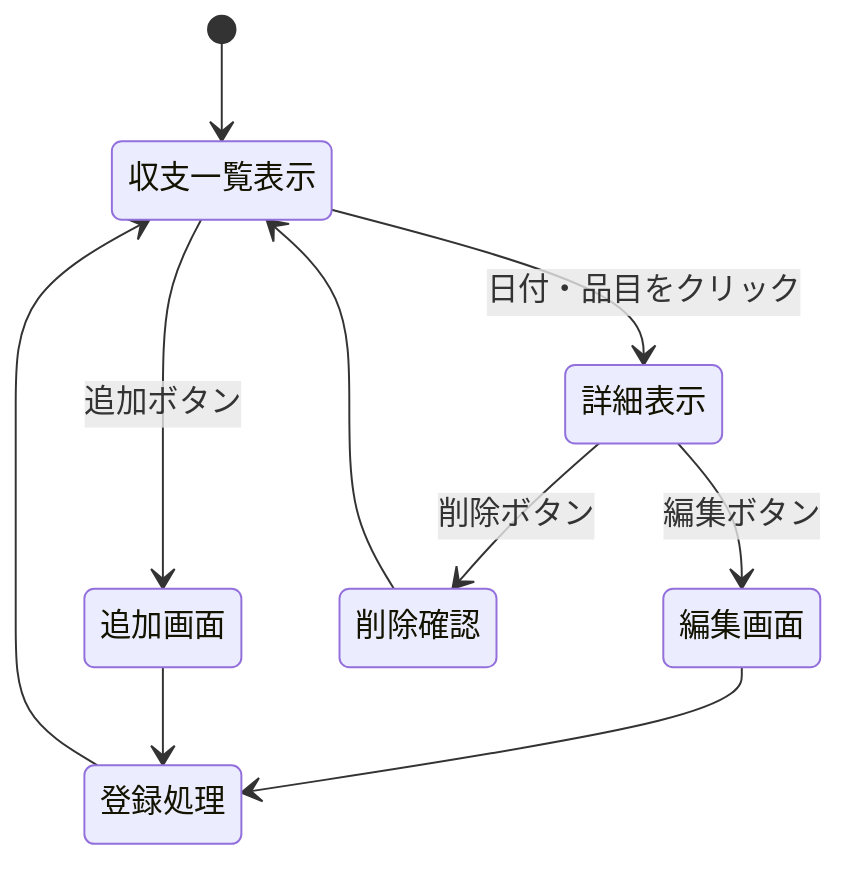

# 開発仕様書

## 24G1137 山下武琉

## 1. 開発者向け仕様書

本章では、開発する3つのWebアプリケーション（家計簿、体調管理、課題管理）それぞれの仕様について記述する。
いずれのシステムも、データはサーバ内の変数配列に一時保存し、REST APIの設計思想に基づいた統一的な操作を提供する。

### 1.1 家計簿システム

#### (1) データ構造
データは `account_entries` 配列で管理する。

| プロパティ名 | データ型 | 説明 | 例 |
| :--- | :--- | :--- | :--- |
| `id` | Integer | データID | `1` |
| `date` | String | 日付 | `"2025-01-20"` |
| `item` | String | 品目 | `"食費"` |
| `amount` | Integer | 金額 | `1500` |
| `type` | String | 区分 (`income`/`expense`) | `"expense"` |
| `memo` | String | メモ | `"コンビニ"` |

#### (2) ページ遷移図
